# RTCW-SP TrueFix Manual

**TrueFix 1.43e**

A practical reference for the commands, HUD features, speedrunning tools, and visual debugging features added by RTCW-SP TrueFix.

> **Note:** This manual describes features available in TrueFix 1.43e. Some features are intended primarily for practice or speedrunning and require cheats to be enabled.

---

# Table of Contents

1. [Introduction](#introduction)
2. [Cheats and Speedrunning](#cheats-and-speedrunning)
3. [`savepos` / `loadpos`](#savepos--loadpos)
4. [`savestate` / `loadstate`](#savestate--loadstate)
5. [Top-Right HUD Speed Display](#top-right-hud-speed-display)
6. [Custom Speedometer](#custom-speedometer)
7. [`cvarcheck`](#cvarcheck)
8. [Trigger Visualization](#trigger-visualization)
9. [Trigger Activation Feedback](#trigger-activation-feedback)
10. [Player Clip Visualization](#player-clip-visualization)
11. [Example Speedrunning Configuration](#example-speedrunning-configuration)
12. [Quick Reference](#quick-reference)
13. [Feature Summary](#feature-summary)

---

# Introduction

RTCW-SP TrueFix is primarily a stability and bug-fix patch for the single-player version of Return to Castle Wolfenstein.

In addition to fixing crashes, memory corruption, save/load problems, and other engine and game-code issues, TrueFix includes a number of features useful for:

* speedrunning
* movement practice
* route development
* map exploration
* debugging
* trigger and collision investigation
* HUD customization

The features described in this manual are designed to be used without changing the normal gameplay experience when they are not enabled.

## Opening the console

The commands in this manual are entered through the RTCW console.

The console is typically accessed by using the default hotkey: `~` (`§` for some keyboard settings)

After opening the console, commands can be executed like the example below:

```text
/cg_speedometer 1
```

Cvars can also be placed in configuration files or key bindings.

---

# Enabling sv_cheats

Several TrueFix features are deliberately protected by `sv_cheats` because they can provide information or functionality that would not normally be available during gameplay.

The `sv_cheats` cvar can not directly be modified through the console.
An easy way to enable it is to run the `spdevmap` command and load any level.
After it has been enabled, it will remain enabled across level changes.
The easiest way to disable it is to restart the game.

Example usage of `spdevmap`:

```text
/spdevmap escape1
```

## Important for speedruns

For serious speedrunning attempts, make sure cheats are disabled before beginning a run.

TrueFix reports when `sv_cheats` is enabled when a new game becomes render-ready:

```text
sv_cheats is enabled
```

This is intended as a visible reminder that cheats are still active.

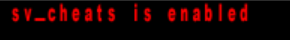

---

# `savepos` / `loadpos`

`savepos` and `loadpos` provide a lightweight position checkpoint intended primarily for movement practice and speedrunning.

Unlike a normal RTCW savegame, these commands do not save the game world.

They save and restore the player's movement state.

## `savepos`

### Syntax

```text
savepos
```

### What it saves

`savepos` stores:

* player position
* player view angles
* player velocity
* player health
* sprint timer
* sprint exertion timer

After successfully saving:

```text
Position saved.
```

is printed to the console.

## `loadpos`

### Syntax

```text
loadpos
```

`loadpos` returns the player to the position saved by `savepos`.

It restores:

* position
* view direction
* velocity
* health
* sprint state

The player's velocity is restored as well, making this useful for practicing movement from an exact state rather than simply teleporting to a location.

## Example

```text
/savepos
```

Perform the movement you want to practice.

Then:

```text
/loadpos
```

The player is returned to the saved state.

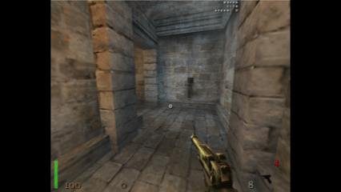

Tip: `savepos` and `loadpos` are regular commands, meaning they can be bound to a key with the `bind` command. Example:

```text
/bind f9 savepos
/bind alt loadpos
```

## Position checkpoints are not world saves

`savepos` does **not** restore:

* enemies
* doors
* switches
* pickups
* scripted events
* destroyed objects
* world state

For restoring the complete game state, use [`savestate`](#savestate--loadstate).

## Cheat protection

Both commands require cheats to be enabled.

If cheats are disabled:

```text
Cheats are not enabled on this server.
```

is displayed.

The player must also be alive.

---

# `savestate` / `loadstate`

> **Experimental feature**

`savestate` and `loadstate` provide an in-memory practice checkpoint that restores substantially more states than `savepos`.

They are intended for rapid practice without repeatedly creating and loading normal RTCW savegames.

## `savestate`

### Syntax

```text
savestate
```

`savestate` creates one in-memory checkpoint of the current game.

The checkpoint includes the player's state as well as the game world and relevant runtime state.

<!-- IMAGE: Screenshot showing a player creating a savestate. -->

## `loadstate`

### Syntax

```text
loadstate
```

`loadstate` restores the previously created checkpoint.

## What is restored?

The practice savestate is designed to restore the complete gameplay state needed for continued practice, including:

* player state
* player position and view
* player velocity
* health and movement state
* weapons and client weapon selection
* NPC state
* AI state
* entities
* doors and movers
* item state
* scripted/world state
* camera state
* relevant temporary runtime state
* game time
* relevant server/client timing state

The restore also synchronizes engine-side state such as entity links and collision/AAS state.

In-game example of resetting back to before the boss2 cutscene, allowing for repeated attempts without loading:

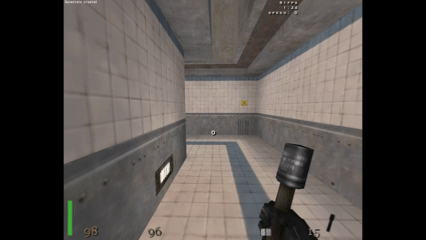

## In-memory only

The practice savestate is **not written to disk**.

It is therefore much faster than a normal save/load cycle.

The checkpoint exists only for the current game session.

A normal map/game initialization invalidates the checkpoint.

## One checkpoint

TrueFix currently maintains one practice checkpoint.

Creating another savestate replaces the previous one.

```text
savestate
```

→ checkpoint A

```text
savestate
```

→ checkpoint A is replaced by checkpoint B

## Same-map practice

The practice savestate is designed for same-map practice.

It does not perform a normal game restart and does not reload the qagame DLL.

This makes it suitable for quickly repeating sections of a level without the overhead of a normal save/load operation.

It is possible to execute while cooking grenade, unlike a normal load game.

Tip: `savestate` and `loadstate` are regular commands, meaning they can be bound to a key with the `bind` command. Example:

```text
/bind f9 savestate
/bind alt loadstate
```

In-game example of repeated loading to right after entering boss2 room (with the grenade pre-cooked):

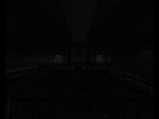

## Cheat protection

`savestate` and `loadstate` require cheats to be enabled.

## Player must be alive when creating a savestate

A savestate cannot be created while dead.

If attempted while dead:

```text
You must be alive to create a savestate.
```

## Important distinction

### `savepos`

Saves a **player movement state**.

### `savestate`

Saves a **gameplay state**.

A useful way to think about the difference is:

| Feature             | `savepos` | `savestate` |
| ------------------- | --------: | ----------: |
| Player position     |         ✓ |           ✓ |
| View direction      |         ✓ |           ✓ |
| Velocity            |         ✓ |           ✓ |
| Health              |         ✓ |           ✓ |
| Sprint state        |         ✓ |           ✓ |
| Weapon state        |         — |           ✓ |
| NPC state           |         — |           ✓ |
| Doors/movers        |         — |           ✓ |
| Items               |         — |           ✓ |
| Scripts/world state |         — |           ✓ |
| Game time           |         — |           ✓ |
| AI state            |         — |           ✓ |
| In-memory           |         ✓ |           ✓ |
| Disk save           |         — |           — |
| Cheat protected     |         ✓ |           ✓ |

---

# Top-Right HUD Speed Display

TrueFix adds a speed display to the existing upper-right HUD area.

It appears in the same general area as the FPS and timer displays.

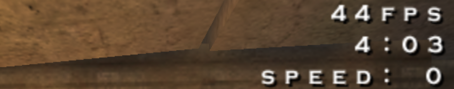

The speed display can be enabled independently:

```text
/cg_drawSpeed 1
```

The display uses the same HUD scale, color, alpha, and shadow settings as the other top-right HUD elements.

---

## `cg_drawSpeed`

Controls the information shown by the top-right speed display.

### Values

| Value | Display                     |
| ----: | --------------------------- |
|   `0` | Disabled                    |
|   `1` | Horizontal speed (X/Y)      |
|   `2` | Absolute 3D speed (X/Y/Z)   |
|   `3` | Velocity components (X/Y/Z) |

### Example

```text
/cg_drawSpeed 1
```

Displays:

```text
speed: 320
```

### Horizontal speed

With:

```text
/cg_drawSpeed 1
```

the displayed speed is calculated from horizontal X/Y velocity.

Vertical movement is ignored.

This is generally the useful speed value for movement and speedrunning.

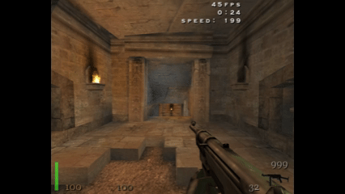

### Absolute 3D speed

With:

```text
/cg_drawSpeed 2
```

the speed includes all three velocity components.

```text
speed: 350
```

This means vertical movement contributes to the displayed value.

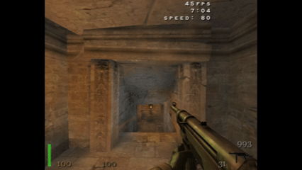

### Velocity components

With:

```text
/cg_drawSpeed 3
```

the display shows the individual velocity components:

```text
vel: 320 0 120
```

The three values correspond to X, Y, and Z velocity.

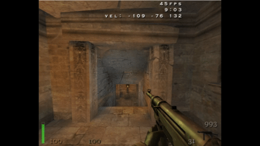

---

## `cg_drawSpeedHelper`

Optional helper mode for the top-right speed display.

### Default

```text
cg_drawSpeedHelper 0
```

### Enable

```text
/cg_drawSpeedHelper 1
```

When enabled, the speed display changes color when the measured horizontal/3D speed is increasing.

The helper uses a yellow highlight when the current speed is greater than the previous displayed speed.

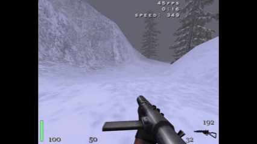

### Cheat protection

`cg_drawSpeedHelper` is cheat protected.

This is intentional because the helper provides additional movement information.

---

# Top-Right HUD Configuration

The top-right HUD speed display shares a common set of configuration variables.

These also affect the existing FPS and timer displays.

---

## `cg_drawHudScale`

Controls the size of the top-right HUD text.

### Default

```text
1.0
```

The value is clamped internally to:

```text
0.25 – 4.0
```

### Example

```text
/cg_drawHudScale 1.5
```

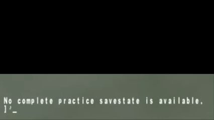

---

## `cg_drawHudColorRed`

Controls the red component of the top-right HUD color.

### Default

```text
1.0
```

Range:

```text
0.0 – 1.0
```

Example:

```text
/cg_drawHudColorRed 1
```

---

## `cg_drawHudColorGreen`

Controls the green component.

### Default

```text
1.0
```

Range:

```text
0.0 – 1.0
```

---

## `cg_drawHudColorBlue`

Controls the blue component.

### Default

```text
1.0
```

Range:

```text
0.0 – 1.0
```

---

## `cg_drawHudColorAlpha`

Controls HUD transparency.

### Default

```text
1.0
```

Range:

```text
0.0 – 1.0
```

`0` is fully transparent and `1` is fully opaque.

Below is an in-game showcase of a few color setting combinations:

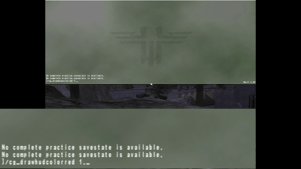

---

## `cg_drawHudShadow`

Controls the text shadow.

### Default

```text
1
```

### Values

| Value | Result         |
| ----: | -------------- |
|   `0` | No shadow      |
|   `1` | Shadow enabled |

Example:

```text
/cg_drawHudShadow 0
```

With shadows:

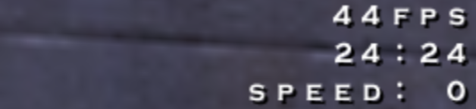

Without shadows:

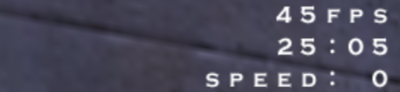

---

# Custom Speedometer

TrueFix 1.43e adds a second speed display that is completely independent of the existing upper-right HUD.

The custom speedometer can be:

* enabled or disabled
* positioned anywhere on the screen
* scaled independently
* given a custom color
* made transparent
* given a custom label
* shown with or without units
* shown with or without a shadow

Unlike `cg_drawSpeed`, the custom speedometer is always based on horizontal X/Y speed.
The scale and color can be controlled similar to `cg_drawspeed` customization settings. 
See below for the full list of commands.

---

# `cg_speedometer`

Enables the custom speedometer.

### Default

```text
0
```

### Values

| Value | Result   |
| ----: | -------- |
|   `0` | Disabled |
|   `1` | Enabled  |

Example:

```text
/cg_speedometer 1
```

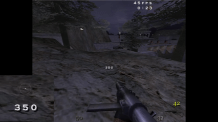

---

# `cg_speedometerX`

Controls the horizontal position of the speedometer.

### Default

```text
0.50
```

The position is specified using normalized screen coordinates:

```text
0.0 = left
0.5 = center
1.0 = right
```

The value is clamped to `0.0–1.0`.

### Examples

Centered:

```text
/cg_speedometerX 0.50
```

Left side:

```text
/cg_speedometerX 0.10
```

Right side:

```text
/cg_speedometerX 0.90
```

---

# `cg_speedometerY`

Controls the vertical position of the speedometer.

### Default

```text
0.55
```

Normalized coordinates:

```text
0.0 = top
0.5 = middle
1.0 = bottom
```

The value is clamped to `0.0–1.0`.

### Examples

Top:

```text
/cg_speedometerY 0.10
```

Center:

```text
/cg_speedometerY 0.50
```

Bottom:

```text
/cg_speedometerY 0.90
```

## Positioning both axes

For example:

```text
/cg_speedometerX 0.50
/cg_speedometerY 0.55
```

places the center of the speedometer approximately in the middle of the screen.

The X/Y coordinates refer to the **center of the text**, rather than its upper-left corner.

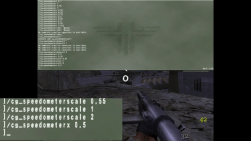

---

# `cg_speedometerScale`

Controls the size of the custom speedometer.

### Default

```text
0.75
```

The value is clamped internally to:

```text
0.25 – 4.0
```

### Examples

Small:

```text
/cg_speedometerScale 0.5
```

Default:

```text
/cg_speedometerScale 0.75
```

Large:

```text
/cg_speedometerScale 1.5
```

---

# Speedometer Color

The speedometer uses separate red, green, blue, and alpha values.

All color components are clamped to:

```text
0.0 – 1.0
```

---

## `cg_speedometerColorRed`

### Default

```text
1.0
```

Controls the red component.

---

## `cg_speedometerColorGreen`

### Default

```text
1.0
```

Controls the green component.

---

## `cg_speedometerColorBlue`

### Default

```text
1.0
```

Controls the blue component.

---

## `cg_speedometerColorAlpha`

### Default

```text
1.0
```

Controls transparency.

### Example

A semi-transparent speedometer:

```text
/cg_speedometerColorAlpha 0.5
```

---

# `cg_speedometerShowUnit`

Controls whether the speedometer displays the unit.

### Default

```text
0
```

### Values

| Value | Example   |
| ----: | --------- |
|   `0` | `320`     |
|   `1` | `320 u/s` |

Enable:

```text
/cg_speedometerShowUnit 1
```

The unit displayed by TrueFix is:

```text
u/s
```

In-game example:


---

# `cg_speedometerLabel`

Adds a custom text label before the speed value.

### Default

```text
""
```

With no label:

```text
320
```

With:

```text
/cg_speedometerLabel "Speed:"
```

the display becomes:

```text
speed: 320
```

In-game example:

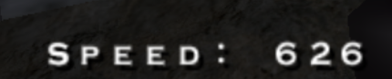

---

# `cg_speedometerShadow`

Controls the custom speedometer's text shadow.

### Default

```text
1
```

### Values

| Value | Result          |
| ----: | --------------- |
|   `0` | Shadow disabled |
|   `1` | Shadow enabled  |

Example:

```text
/cg_speedometerShadow 0
```

---

## Example speedrunning HUD

The two speed displays can also be used independently.

For example:

```text
/cg_drawSpeed 1
/cg_drawHudScale 0.5
/cg_drawHudShadow 1

/cg_speedometer 1
/cg_speedometerX 0.50
/cg_speedometerY 0.55
/cg_speedometerScale 0.75
/cg_speedometerShowUnit 0
/cg_speedometerShadow 1
```

This provides the normal top-right speed display while also placing an independently configurable speedometer elsewhere on the screen.

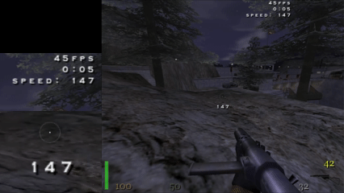

---

# `cvarcheck`

`cvarcheck` verifies a set of speedrun-relevant gameplay configuration variables against their expected values.

### Syntax

```text
cvarcheck
```

The command is intended to make it easy to verify that important gameplay variables have not accidentally been changed before or after a speedrun.
The command does not print on top of cutscenes, meaning that the console need to be inspected if inside a cutscene, like in the end of a full run.

If all values match:

```text
SPEEDRUN CVAR CHECK: PASS
```

is displayed.

If one or more values do not match:

```text
SPEEDRUN CVAR CHECK: FAIL
```

is displayed.

In-game example:

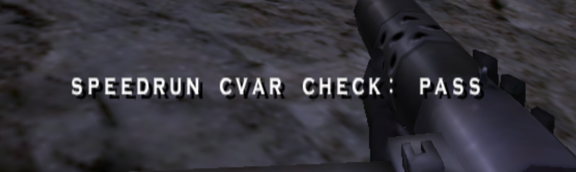

The result is also printed to the console:

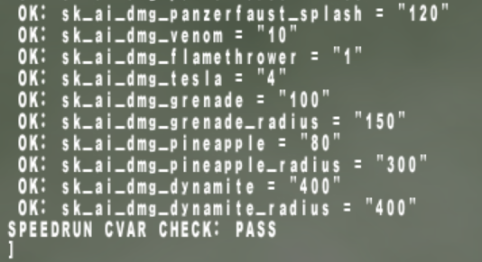

## Checked values

TrueFix checks the following values.

### Standard configuration

| Cvar        | Expected value |
| ----------- | -------------: |
| `g_speed`   |          `320` |
| `g_gravity` |          `800` |
| `timescale` |            `1` |

### Health / armor / ammo behavior

| Cvar                          | Expected |
| ----------------------------- | -------: |
| `sk_rot_health`               |      `0` |
| `sk_rot_armor`                |      `0` |
| `sk_brandy_ignore_max_health` |      `0` |
| `sk_dropped_weapon_min_ammo`  |   `0.25` |

### Maximum health / armor / ammunition

| Cvar                 | Expected |
| -------------------- | -------: |
| `sk_max_mega_health` |    `200` |
| `sk_max_armor`       |    `100` |
| `sk_max_9mm`         |    `300` |
| `sk_max_45cal`       |    `300` |
| `sk_max_792mm`       |    `200` |
| `sk_max_30cal`       |     `20` |
| `sk_max_127mm`       |   `1000` |
| `sk_max_pf_rockets`  |      `5` |
| `sk_max_fuel`        |    `150` |
| `sk_max_cells`       |    `300` |
| `sk_max_grenades`    |     `15` |
| `sk_max_pineapples`  |     `15` |
| `sk_max_dynamite`    |     `10` |

### Player damage

| Cvar                            | Expected |
| ------------------------------- | -------: |
| `sk_plr_dmg_knife`              |      `5` |
| `sk_plr_dmg_kick`               |     `15` |
| `sk_plr_dmg_luger`              |      `6` |
| `sk_plr_dmg_colt`               |      `8` |
| `sk_plr_dmg_mp40`               |      `6` |
| `sk_plr_dmg_thompson`           |      `8` |
| `sk_plr_dmg_sten`               |     `10` |
| `sk_plr_dmg_mauser`             |     `20` |
| `sk_plr_dmg_sniperrifle`        |     `55` |
| `sk_plr_dmg_garand`             |     `25` |
| `sk_plr_dmg_snooperscope`       |     `25` |
| `sk_plr_dmg_fg42`               |     `20` |
| `sk_plr_dmg_fg42scope`          |     `35` |
| `sk_plr_dmg_panzerfaust`        |    `200` |
| `sk_plr_dmg_panzerfaust_splash` |    `200` |
| `sk_plr_dmg_venom`              |     `12` |
| `sk_plr_dmg_flamethrower`       |      `2` |
| `sk_plr_dmg_tesla`              |      `8` |
| `sk_plr_dmg_grenade`            |    `200` |
| `sk_plr_dmg_grenade_radius`     |    `150` |
| `sk_plr_dmg_pineapple`          |    `160` |
| `sk_plr_dmg_pineapple_radius`   |    `300` |
| `sk_plr_dmg_dynamite`           |    `800` |
| `sk_plr_dmg_dynamite_radius`    |    `400` |

### AI damage

| Cvar                           | Expected |
| ------------------------------ | -------: |
| `sk_ai_dmg_knife`              |      `5` |
| `sk_ai_dmg_luger`              |      `6` |
| `sk_ai_dmg_colt`               |      `8` |
| `sk_ai_dmg_mp40`               |      `6` |
| `sk_ai_dmg_thompson`           |      `8` |
| `sk_ai_dmg_sten`               |      `8` |
| `sk_ai_dmg_mauser`             |     `20` |
| `sk_ai_dmg_sniperrifle`        |     `50` |
| `sk_ai_dmg_garand`             |     `20` |
| `sk_ai_dmg_snooperscope`       |     `25` |
| `sk_ai_dmg_fg42`               |     `15` |
| `sk_ai_dmg_fg42scope`          |     `15` |
| `sk_ai_dmg_panzerfaust`        |    `100` |
| `sk_ai_dmg_panzerfaust_splash` |    `120` |
| `sk_ai_dmg_venom`              |     `10` |
| `sk_ai_dmg_flamethrower`       |      `1` |
| `sk_ai_dmg_tesla`              |      `4` |
| `sk_ai_dmg_grenade`            |    `100` |
| `sk_ai_dmg_grenade_radius`     |    `150` |
| `sk_ai_dmg_pineapple`          |     `80` |
| `sk_ai_dmg_pineapple_radius`   |    `300` |
| `sk_ai_dmg_dynamite`           |    `400` |
| `sk_ai_dmg_dynamite_radius`    |    `400` |

---

# Trigger Visualization

TrueFix adds a way to visualize normally invisible trigger brushes.

## `g_drawTriggers`

### Default

```text
0
```

Enable:

```text
/g_drawTriggers 1
```

When enabled, trigger geometry is included in the game view so that the normally invisible trigger brushes can be seen.

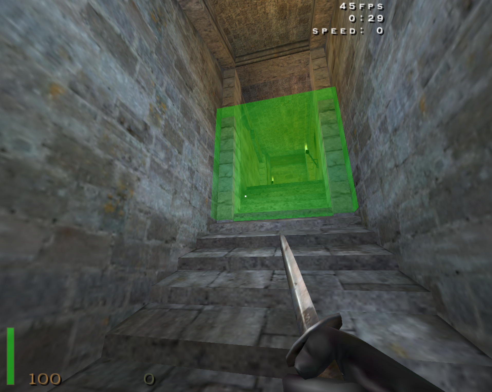

## Example

```text
/g_drawTriggers 1
```

Disable again with:

```text
/g_drawTriggers 0
```

### Cheat protection

`g_drawTriggers` is cheat protected.

---

# Trigger Activation Feedback

TrueFix also provides optional audio feedback when the player activates a trigger.

## `g_triggerFeedback`

### Default

```text
0
```

Enable:

```text
/g_triggerFeedback 1
```

When enabled, the player receives sound feedback when a trigger is activated.

This can be useful when practicing trying to avoid a trigger (like with low FPS).

The feature can be combined with trigger visualization:

```text
/g_drawTriggers 1
/g_triggerFeedback 1
```

This provides both visual and audio feedback.

### Cheat protection

`g_triggerFeedback` is cheat protected.

---

# Player Clip Visualization

RTCW maps contain invisible player-clip brushes that affect player movement and collision.

TrueFix adds a renderer option to visualize them.

## `r_drawPlayerClips`

### Default

```text
0
```

Enable:

```text
/r_drawPlayerClips 1
```

When enabled, player-clip geometry is drawn so that invisible collision boundaries can be inspected.

This can be useful for:

* movement analysis
* speedrunning
* route development
* investigating unexpected collision
* understanding map geometry
* debugging movement behavior

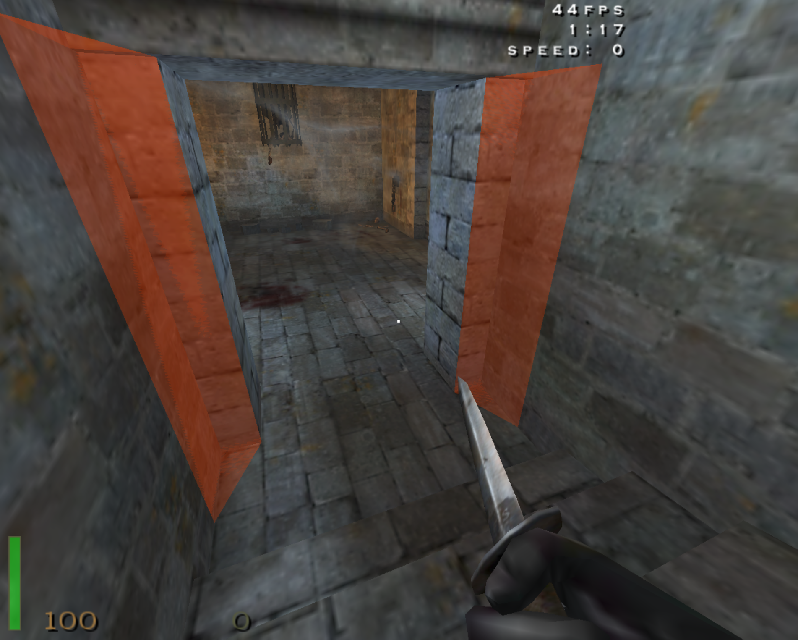

Disable again:

```text
/r_drawPlayerClips 0
```

### Cheat protection

`r_drawPlayerClips` is cheat protected.

---

# Quick Reference

## Practice commands

| Command     | Description                                    | Cheats |
| ----------- | ---------------------------------------------- | ------ |
| `savepos`   | Save player movement/position state            | Yes    |
| `loadpos`   | Restore player movement/position state         | Yes    |
| `savestate` | Create complete in-memory practice checkpoint  | Yes    |
| `loadstate` | Restore complete in-memory practice checkpoint | Yes    |

---

## Speed HUD

| Cvar                   | Default | Description                              |
| ---------------------- | ------: | ---------------------------------------- |
| `cg_drawSpeed`         |     `0` | Enable/configure top-right speed display |
| `cg_drawSpeedHelper`   |     `0` | Highlight increasing speed               |
| `cg_drawHudScale`      |   `1.0` | Top-right HUD scale                      |
| `cg_drawHudColorRed`   |   `1.0` | Top-right HUD red                        |
| `cg_drawHudColorGreen` |   `1.0` | Top-right HUD green                      |
| `cg_drawHudColorBlue`  |   `1.0` | Top-right HUD blue                       |
| `cg_drawHudColorAlpha` |   `1.0` | Top-right HUD transparency               |
| `cg_drawHudShadow`     |     `1` | Top-right HUD shadow                     |

### `cg_drawSpeed` modes

| Value | Meaning                   |
| ----: | ------------------------- |
|   `0` | Off                       |
|   `1` | Horizontal XY speed       |
|   `2` | Absolute XYZ speed        |
|   `3` | X/Y/Z velocity components |

---

## Custom speedometer

| Cvar                       | Default | Description         |
| -------------------------- | ------: | ------------------- |
| `cg_speedometer`           |     `0` | Enable speedometer  |
| `cg_speedometerX`          |  `0.50` | Horizontal position |
| `cg_speedometerY`          |  `0.55` | Vertical position   |
| `cg_speedometerScale`      |  `0.75` | Text scale          |
| `cg_speedometerColorRed`   |   `1.0` | Red component       |
| `cg_speedometerColorGreen` |   `1.0` | Green component     |
| `cg_speedometerColorBlue`  |   `1.0` | Blue component      |
| `cg_speedometerColorAlpha` |   `1.0` | Transparency        |
| `cg_speedometerShowUnit`   |     `0` | Show `u/s`          |
| `cg_speedometerLabel`      |    `""` | Custom label        |
| `cg_speedometerShadow`     |     `1` | Text shadow         |

---

## Debugging / map visualization

| Cvar / command      | Default | Description                            | Cheats |
| ------------------- | ------: | -------------------------------------- | ------ |
| `cvarcheck`         |       — | Check speedrun-relevant gameplay cvars | —      |
| `g_drawTriggers`    |     `0` | Visualize trigger brushes              | Yes    |
| `g_triggerFeedback` |     `0` | Audio feedback when triggers activate  | Yes    |
| `r_drawPlayerClips` |     `0` | Visualize player-clip geometry         | Yes    |

---

# Notes

TrueFix is primarily a stability and correctness patch. Features described here are additional tools intended for practice, speedrunning, debugging, and HUD customization.

Some features, particularly `savestate`/`loadstate`, are experimental and may change in future releases.

For the most current information, consult the TrueFix source repository and release notes.
